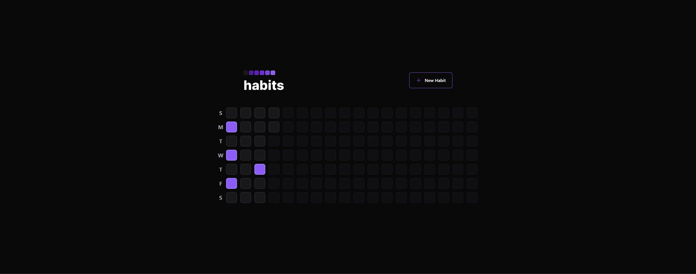
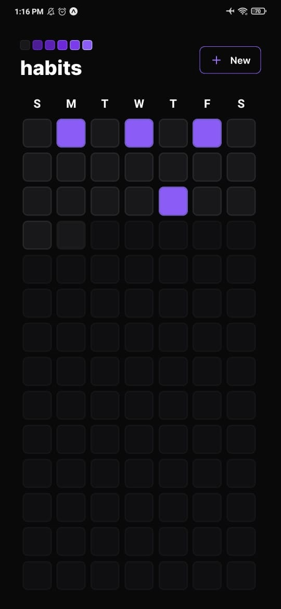

# Rocketseat Bootcamp: NLW Setup 

<h1 align="center"> </h1>
<h1 align="center"> </h1>

**About this Project:**

This was the project developed at NLW Setup.

This project has a server, website, and mobile app.

This project was made so that the user can control his daily habits by marking whether the habit was carried out or not, the user is prevented from marking habits of retroactive dates.

The website version was developed in react, with the styles made by tailwind and the dynamic styles with clsx.

The mobile version was developed in react-native, with the styles made in nativewind and the dynamic styles with clsx.

The server was made in sqlite to save the data, to manage the data it was used in the prisma tool.

**Technologies**

Mobile:  
- Typescript
- React Native
- Expo
- clsx
- Nativewind
- Axios
- React Native SVG Transformer
- React Native Reanimated
- React Navigation
- dayjs

Web:  
- Tailwind
- Typescript
- Axios
- React
- Vite
- clsx
- Radix UI
- dayjs

Server:   
- Typescript
- Prisma
- SQLite
- Zod
- Fastify
- dayjs